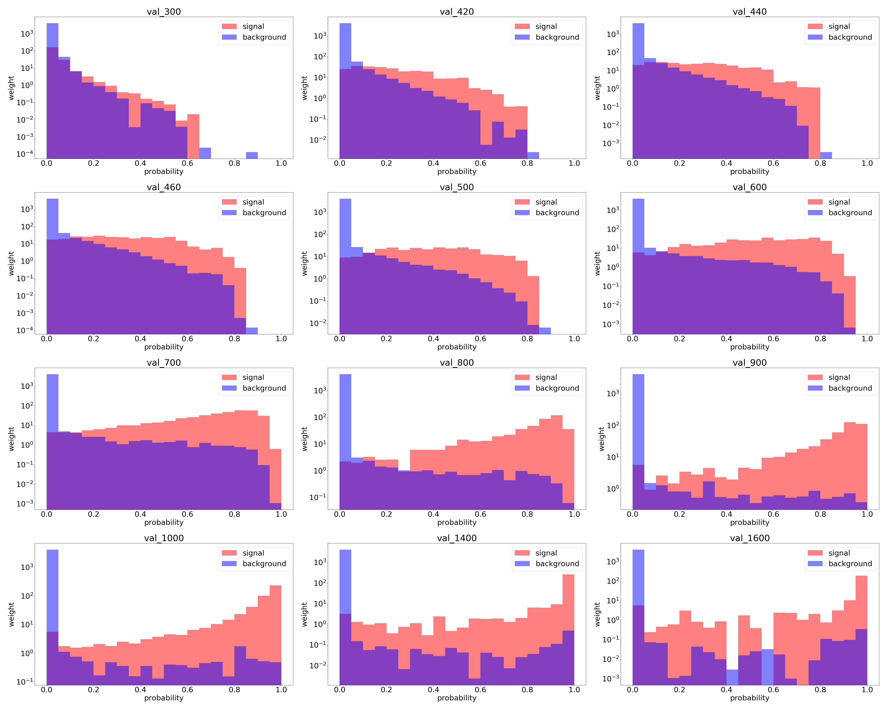

# HiggsML

HiggsML is a machine learning project with the aim of classifying data from the 
Large Hadron Collider (LHC) at CERN to be able to detect the presence of a new 
type of Higgs Boson, labeled *A*. A parameterised neural network classifier is implemented in PyTorch and trained on
approximately two million simulated events, over a range of masses of *A*. 
One of the input features is the mass of the *A* boson as given to the simulation -
this addition parameterises the network.

This project is still under development.

## Example Output

This is an example of the neural network output for a selection of mass points. 
The events are binned according to output probability (1 = signal-like, 
0 = background-like) and coloured based on whether the true label is signal (red)
or background (blue); regions of overlap are purple. Each event has an associated
weight and the total weight of each bin is read off of the vertical axis, which uses
a log scale.

## Summary of Implementation and Results
This is the main component in a third year physics undergraduate research project at
Queen Mary University of London. The aim was to train a machine learning model to 
separate signal and background events produced by proton-proton collisions
in the ATLAS detector of the LHC. 

To begin the coding component of the project, it was necessary to become familiar with
the PyTorch package, so I built a toy model using the MNIST digits dataset. Folowing
this, several iterations of neural networks were made to fit the project dataset, and
new code was written to automate hyperparameter optimisation and validate model 
performance.

It was found to be very difficult to cleanly separate the signal and background. One 
interesting idea that was explored was to reduce the relative weighting of signal 
events compared to background events - in essence, reducing the effect of signal 
on the network - and this was shown to improve performance significantly.

 

